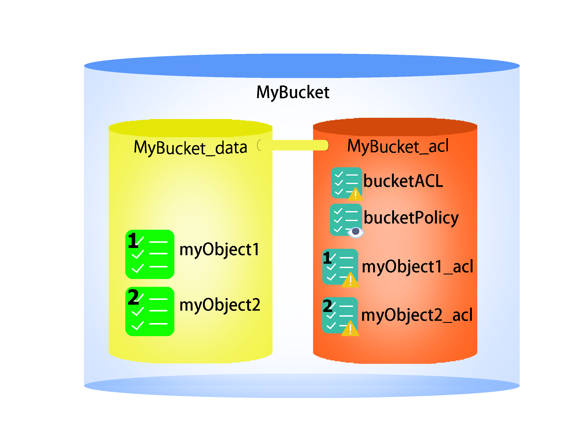
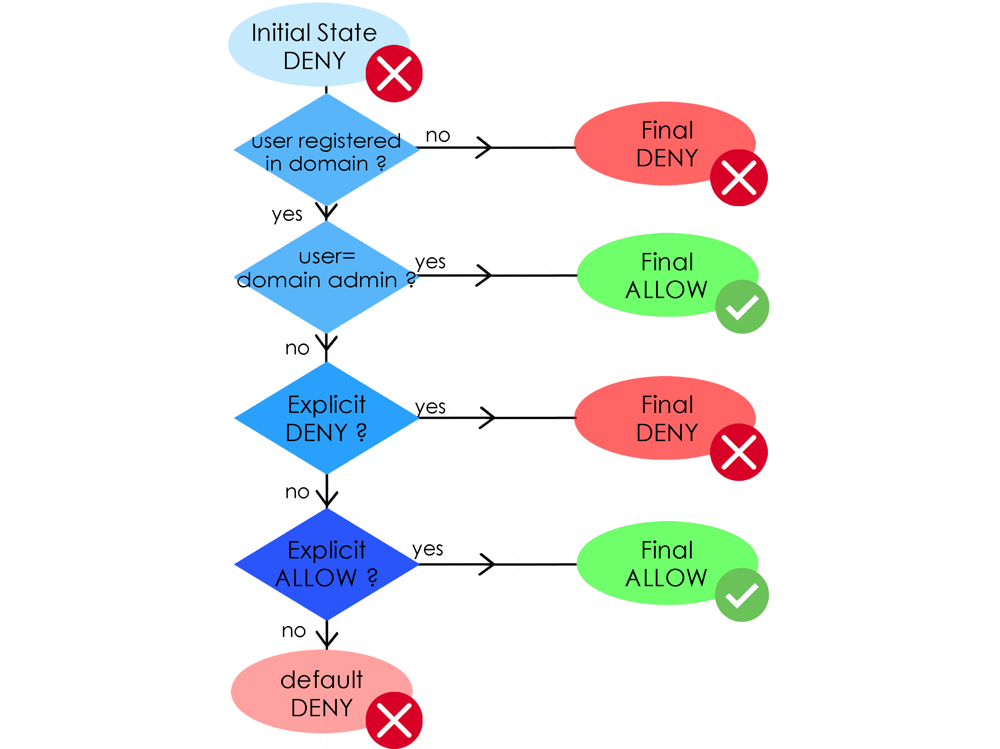

Use S3 Access Control for Antidote
-----------

### Resource management ###

Access Resources are organised as follows : 

### Managing ACLs ###

- ACL can be build with an object : 

		Map<user, permissions>

- to read ACLs from the database, create an empty S3ACL object and call : 

		aclObject.readForUser(S3InteractiveTransaction tx, ByteString bucket, ByteString userid)

- to assign permissions to a remote ACL, create an object, pass it the permissions and assign it, for example with an object ACL :

		S3ACL acl = new S3ObjectACL();
		acl.setRight("user1", "read");
		acl.setRight("user2", "write");
		acl.assign(s3Transaction, bucketName, objectKey); 

		
### Managing Policies ###

- Policies can be build with a list of groups and a list of S3Statement object : 

		S3Policy(List<ByteString> groups, List<S3Statement> statements)		

- to read a Policy from the database, create an empty S3Policy object and call : 

		aclObject.readForUser(S3InteractiveTransaction tx, ByteString bucket, ByteString userid)

- to assign permissions to a remote ACL, create an object, pass it the permissions and assign it, for example with an object ACL :

		S3Policy bucketPolicy = new S3BucketPolicy();
		bucketPolicy.addStatement(statement1);
		bucketPolicy.assign(s3Transaction, bucketKey);

#### Statement Object ####

S3Statement represent a permission, with the following fields : 
- effect : allow or deny
- principals : list of actors that can perform actions
- action : list of actions 
- ressources : either a list of bucket, of object keys or of object type
- conditionBlock : optional conditions on the access environment

S3Statement may be build with the API :

		S3Statement(boolean effect, List<String> principals, List<String> actions, ByteString bucketKey, String conditionBlock);

### Access Procedure ###

The access decision is performed using the following process :

#### credits #### 
icons in following pictures :

  * MadeByOliver
  * Icon Pound

